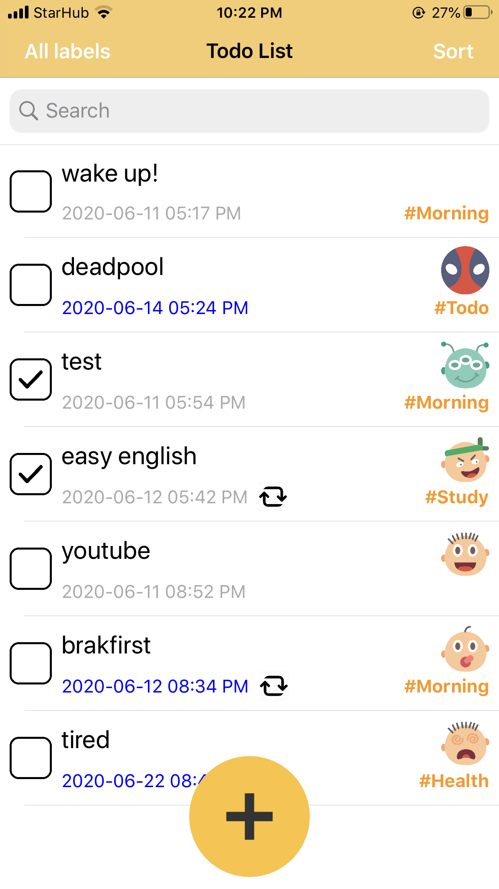
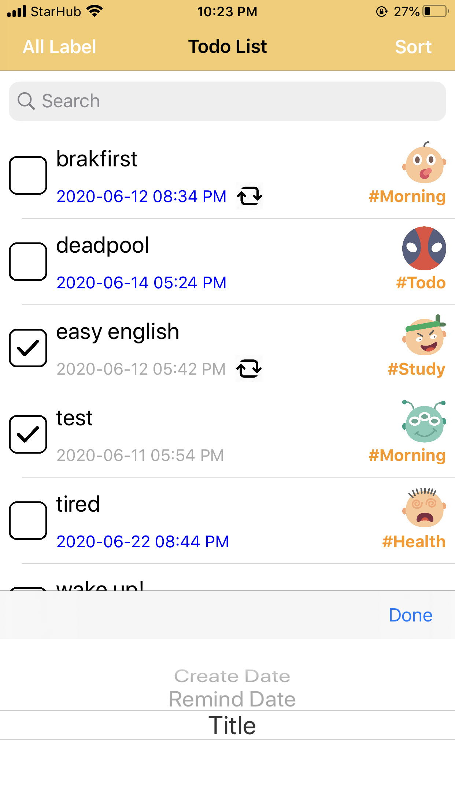
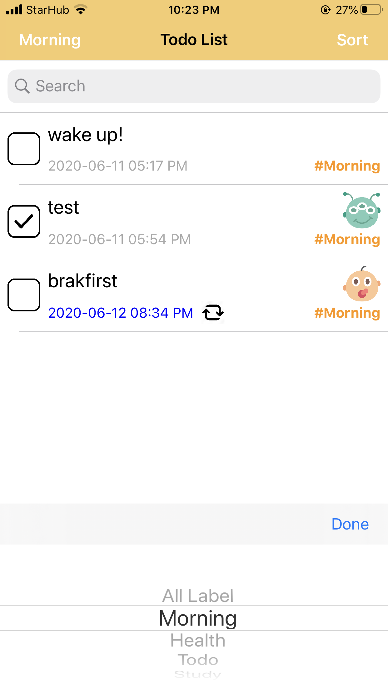
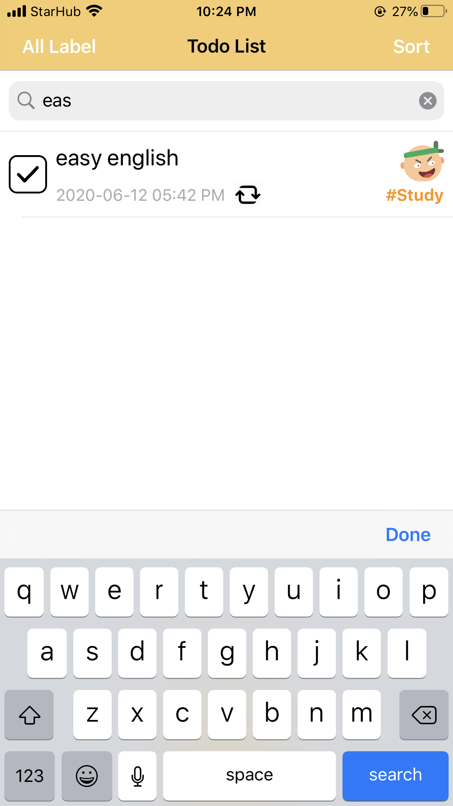
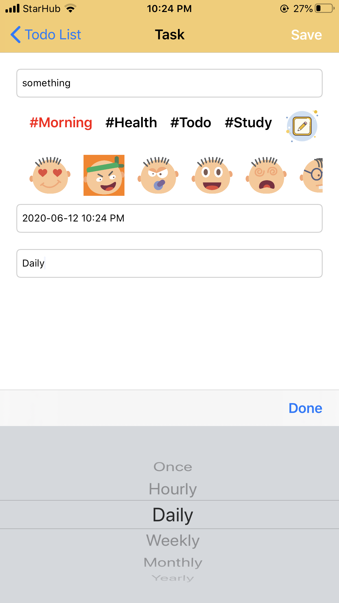
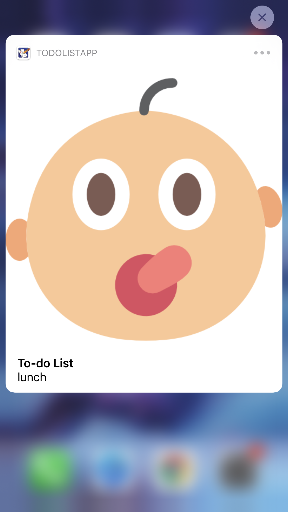
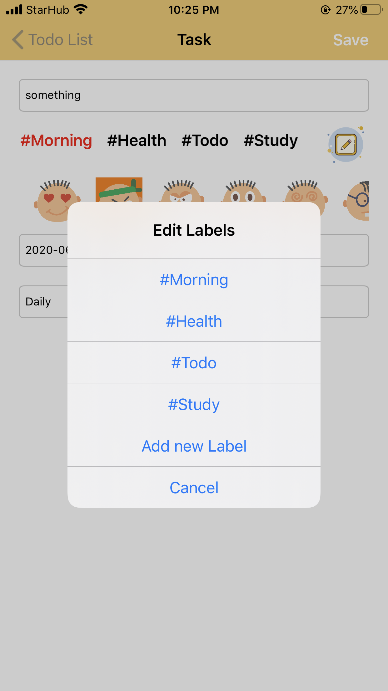
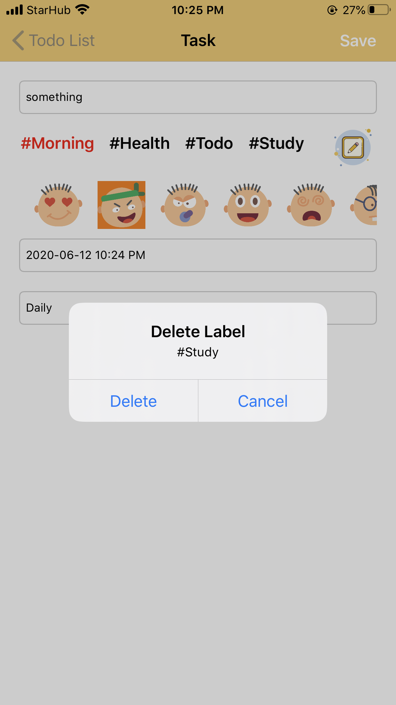
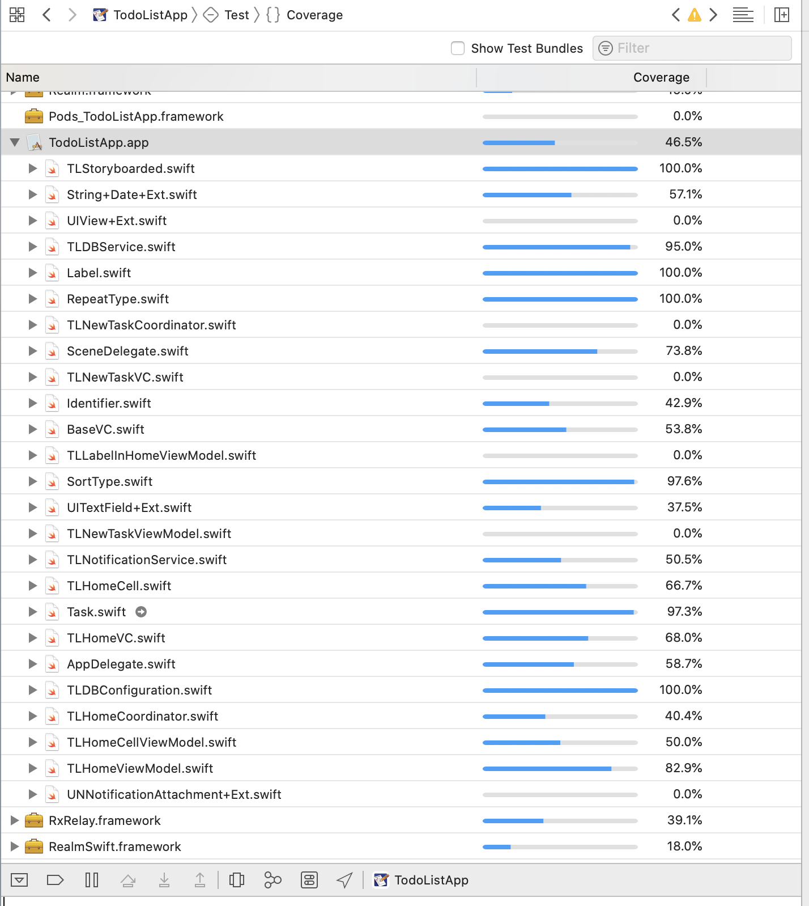

# TodoList
To-do list application

# Compatibility
- This project is written in Swift 5 and Xcode 11.5

# Minimum iOS version required
- iOS 10.0

# Step-by-step guide

### Prerequisites  
Please use Xcode 11

### STEP 1  
It is recommended to install the TodoList for iOS via [cocoapods](http://cocoapods.org). If you do not have it installed, follow the below steps:

#### Installing Cocoapods  
Check that you have Xcode command line tools installed (Xcode > Preferences > Locations > Command line tools([?](http://osxdaily.com/2014/02/12/install-command-line-tools-mac-os-x/)). If not, open the terminal and run `xcode-select --install`.
Install cocoa pods in the terminal: `$ sudo gem install cocoapods`

### STEP 2  
Clone the repo or download the project.

### STEP 3  
Navigate to the project directory and Run `pod install`

#### STEP 4  
Open the .xcworkspace file

### STEP 5  
Select target device , build and Run. Enjoy!

# Tools
- RxSwift
- Realm

# Application Architectural Pattern
- MVVM

# Features
- CRUD (Task), CRD (Label)
- Sort (Sort Task base on Create Date, Remind Date, Title)

- Filter (base on Label)

- Search (Task)

- Media attachment (can add attach image for task and notification)

- Reminder (Notification for task. Include types: once, hourly, daily, weekly, monthly, yearly)

- Label (Create, Read, Delete)

# Others
- UnitTest

# Author
- [Charlie](https://www.linkedin.com/in/cuong-hoang-b650715a)

# License
Copyright 2017 Charlie
